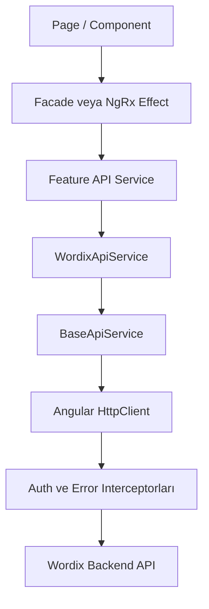
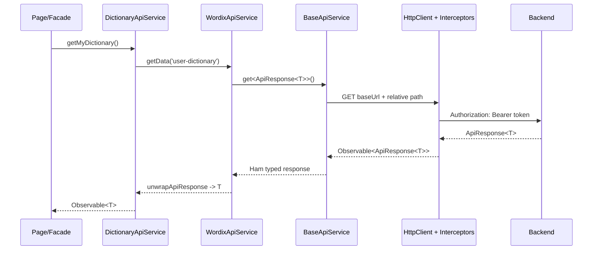

# Angular API Client Core — Mimari, Uygulama ve Mentör Görüşmesi Rehberi

Bu doküman, Wordix projesinde oluşturduğumuz reusable Angular API Client Core yapısının ne olduğunu, hangi aşamalardan geçtiğini, hangi dosyanın neden bulunduğunu, hangi problemleri çözdüğünü ve neden ayrı bir GitHub repository'ye çıkardığımızı ayrıntılı biçimde açıklar. Son bölümde henüz yapmadığımız npm release işlemi de ayrıca anlatılır.

> Önemli durum: Library GitHub'a public olarak çıkarılmıştır ancak npm registry'ye henüz yayınlanmamıştır. Bu iki işlem aynı şey değildir.

## 1. En kısa özet

Mentörün “Ne yaptınız?” diye sorarsa şu kısa cevabı verebilirsin:

> Angular uygulamalarında tekrar eden `HttpClient`, base URL birleştirme ve HTTP verb kullanımını reusable bir abstract `BaseApiService` altında topladık. Wordix'e özel `ApiResponse<T>` açma davranışını genel library'ye koymak yerine ayrı bir `WordixApiService` adaptöründe tuttuk. Profile, Lookup, Quiz, Deck, Dictionary, Statistics ve Admin Analytics servislerini bu adaptörden inheritance alacak şekilde geçirdik. Sonra genel library'yi Wordix'ten bağımsız bir Angular workspace'e çıkardık, test/build/npm package/consumer kurulum kontrollerinden geçirdik ve public GitHub repository'ye gönderdik.

Bu yapının ana fikri şudur:

```text
Genel HTTP altyapısı       -> angular-api-client-core
Wordix response davranışı  -> WordixApiService
Endpoint ve DTO bilgisi    -> Feature API servisleri
UI/state akışı             -> Facade, NgRx ve componentler
```

## 2. Başlangıçta hangi problem vardı?

API servisleri çalışıyordu fakat birçok feature servisinde aşağıdaki altyapı tekrar ediyordu:

- `HttpClient` doğrudan inject ediliyordu.
- `AppConfigService` üzerinden API base URL tekrar okunuyordu.
- Base URL sonundaki slash tekrar temizleniyordu.
- Her serviste URL stringi tekrar birleştiriliyordu.
- Her serviste `ApiResponse<T>` generic tipi tekrar yazılıyordu.
- Her serviste `map(unwrapApiResponse)` tekrar kullanılıyordu.
- GET, POST, PUT ve DELETE çağrılarında aynı mekanik kod yeniden yazılıyordu.
- Header, query, timeout ve credential seçeneklerinin standardı feature servislerine bırakılıyordu.

Örnek olarak eski servislerin kavramsal şekli şuydu:

```ts
export class ExampleApiService {
  private readonly http = inject(HttpClient);
  private readonly baseUrl = inject(AppConfigService).apiBaseUrl;

  getItems(): Observable<ItemDto[]> {
    return this.http
      .get<ApiResponse<ItemDto[]>>(`${this.baseUrl}/items`)
      .pipe(map(unwrapApiResponse));
  }
}
```

Bu kod yanlış veya çalışmaz değildi. Problem, aynı sorumluluğun birçok dosyada tekrar etmesiydi.

### 2.1 Bu tekrar neden gerçek bir problemdir?

Tekrar eden altyapı küçük projede rahatsız etmeyebilir. Proje büyüdükçe şu riskleri oluşturur:

1. Bir serviste URL slash davranışı farklı uygulanabilir.
2. Bir serviste response zarfı açılırken diğerinde unutulabilir.
3. Yeni bir request option eklemek için birçok servis değiştirilebilir.
4. Testlerde her servise ayrı config mocku hazırlanır.
5. Feature servisleri business endpoint yerine HTTP altyapısıyla ilgilenmeye başlar.
6. Ortak güvenlik kuralını tüm servislere aynı şekilde uygulamak zorlaşır.
7. Başka projede aynı yapı gerektiğinde kodlar elle kopyalanır.

Mentörün istediği çözüm bu tekrarları merkezi ve tekrar kullanılabilir bir katmana taşımaktı.

## 3. Hedef mimari ne oldu?

İstek yalnızca “bir tane ortak service yazalım” değildi. Yapının başka geliştiricilerin de kullanabileceği kadar genel olması gerekiyordu.

Bu nedenle üç ayrı katman oluşturduk:



### 3.1 Katmanların sorumluluğu

| Katman              | Sorumluluk                                           | Bilmemesi gerekenler                    |
| ------------------- | ---------------------------------------------------- | --------------------------------------- |
| `BaseApiService`    | Typed HTTP verbleri, base URL ve request seçenekleri | Wordix, Keycloak, DTO, NgRx             |
| `WordixApiService`  | Wordix `ApiResponse<T>` zarfını açmak                | Feature endpoint detayları, UI          |
| Feature API service | Endpoint pathi ve request/response DTO tipi          | `HttpClient`, base URL, response mapper |
| Facade/Effect       | State, loading, success/failure ve side effect       | Düşük seviyeli HTTP kurulumu            |
| Component/Page      | Kullanıcı etkileşimi ve görünüm                      | HTTP ve NgRx implementation ayrıntısı   |

Bu ayrım yapının reusable kalmasını sağladı.

## 4. Request uygulama içinde nasıl ilerliyor?

Örneğin kullanıcı dictionary listesini açtığında kavramsal akış şöyledir:

1. Page veya route dictionary yükleme niyetini başlatır.
2. Facade/NgRx effect `DictionaryApiService.getMyDictionary()` metodunu çağırır.
3. `DictionaryApiService`, `WordixApiService.getData()` metodunu kullanır.
4. `WordixApiService`, genel library'deki protected `get()` metodunu çağırır.
5. `BaseApiService`, configured base URL ile relative pathi güvenli biçimde birleştirir.
6. Angular `HttpClient` isteği gönderir.
7. Auth interceptor bearer tokenı ekler.
8. Backend `ApiResponse<GetMyDictionaryResponseDto>` döndürür.
9. `WordixApiService`, response içindeki `data` alanını çıkarır.
10. Feature service çağrısını yapan effect/facade yalnızca gerçek DTO payloadını alır.

Response akışı ters yönde ilerler:



## 5. Hangi aşamalarda neler yaptık?

Çalışmayı tek seferde bütün servislere uygulamadık. Küçük ve doğrulanabilir fazlarla ilerledik.

### Aşama 1 — Mevcut HTTP yapısını audit ettik

Amaç, varsayım yapmadan mevcut servisleri ve tekrarları bulmaktı.

Kontrol edilen başlıklar:

- Hangi feature servisleri doğrudan `HttpClient` kullanıyor?
- Base URL nereden geliyor?
- Backend response zarfı nasıl açılıyor?
- Hangi HTTP verbleri kullanılıyor?
- Query parametreleri nasıl hazırlanıyor?
- DELETE body kullanan endpoint var mı?
- Testler hangi providerları mockluyor?
- Swagger sözleşmesiyle servisler uyumlu mu?

Sonuç: Genel katmana taşınabilecek davranışla Wordix'e özel davranış birbirinden ayrıldı.

İlgili rapor:

- `docs/phase-reports/API-CLIENT-CORE-AUDIT.md`

### Aşama 2 — Genel Angular library çekirdeğini oluşturduk

`projects/angular-api-client-core` altında gerçek bir Angular library projesi açıldı.

Library şu yetenekleri sağladı:

- Merkezi `baseUrl` configuration
- Typed GET
- Typed POST
- Typed PUT
- Typed PATCH
- Typed DELETE
- Headers
- Query params
- `HttpContext`
- Timeout
- Credential seçenekleri
- Angular transfer cache seçeneği
- Opsiyonel DELETE body
- Relative URL güvenlik kontrolleri

Bu aşamada library içine Wordix adı, Wordix DTO'su veya Keycloak bilgisi eklenmedi.

İlgili rapor:

- `docs/phase-reports/API-CLIENT-CORE-LIBRARY.md`

### Aşama 3 — Wordix adaptörünü oluşturduk

Genel library backend response formatını bilmez. Wordix backend ise `ApiResponse<T>` formatını kullanır.

Bu iki dünyayı bağlamak için:

```text
src/app/core/http/wordix-api.service.ts
```

oluşturuldu.

Bu adaptör:

- `getData`
- `postData`
- `putData`
- `patchData`
- `deleteData`

metotlarını sunar ve her response için `unwrapApiResponse` uygular.

Bu karar sayesinde genel GitHub library'si başka bir backend tarafından da kullanılabilir.

### Aşama 4 — Önce küçük bir pilot yaptık

İlk olarak `ProfileApiService` geçirildi.

Neden Profile seçildi?

- Tek ve basit GET endpointi vardı.
- Ownership parametresi göndermiyordu.
- Response unwrap davranışını doğrulamak kolaydı.
- Büyük mutation akışlarını riske atmadan inheritance zinciri test edilebildi.

İlgili rapor:

- `docs/phase-reports/API-CLIENT-CORE-PILOT.md`

### Aşama 5 — Lookup ve Quiz servislerini geçirdik

Bu aşamada typed POST işlemleri doğrulandı.

- Lookup request/response
- Quiz oluşturma
- Quiz cevap gönderme
- Quiz summary
- Recommendation save

Bu geçiş, genel clientın yalnızca GET değil mutation çağrılarını da taşıyabildiğini gösterdi.

İlgili rapor:

- `docs/phase-reports/API-CLIENT-CORE-LOOKUP-QUIZ.md`

### Aşama 6 — Deck servisini geçirdik

Deck servisi şu kombinasyonu doğruladı:

- Collection GET
- Detail GET
- POST create
- Nested route POST
- Body içermeyen DELETE
- Dynamic route segment encoding

İlgili rapor:

- `docs/phase-reports/API-CLIENT-CORE-DECK.md`

### Aşama 7 — Dictionary servisini geçirdik

Dictionary en geniş mutation yüzeylerinden biriydi.

Toplam 11 backend operasyonu taşındı:

- Dictionary list
- Dictionary detail
- Learning item save
- Sentence save
- Notes list
- Note create
- Note update
- Note delete
- Flags list
- Flag set
- Flag remove

Bu aşama GET, POST, PUT ve DELETE verblerinin aynı feature içinde birlikte çalıştığını doğruladı.

İlgili rapor:

- `docs/phase-reports/API-CLIENT-CORE-DICTIONARY.md`

### Aşama 8 — Statistics servisini geçirdik

Statistics servisinin önemi query parametreleriydi.

Korunan davranışlar:

- Swagger'daki PascalCase query adları
- Opsiyonel tarih filtreleri
- Pagination
- Sort ve filter parametreleri
- `undefined`, `null` ve boş değerleri göndermeme

Ek olarak daha önce doğrudan test edilmeyen iki endpoint testi eklendi.

İlgili rapor:

- `docs/phase-reports/API-CLIENT-CORE-STATISTICS.md`

### Aşama 9 — Admin Analytics servisini geçirdik

Son doğrudan `HttpClient` kullanan feature servisi de taşındı.

Korunan davranışlar:

- Admin endpoint pathleri
- `FromUtc`, `ToUtc`, `Limit`
- Admin role guard
- Bearer token interceptor
- Response unwrap

Sonuçta yedi feature API servisinin tamamı `WordixApiService` üzerinden çalışmaya başladı.

İlgili rapor:

- `docs/phase-reports/API-CLIENT-CORE-ADMIN-ANALYTICS.md`

### Aşama 10 — Açık kaynak kullanım dokümanını hazırladık

Library README'si yalnızca birkaç kod örneği olmaktan çıkarıldı.

Eklenen ana bölümler:

- Kurulum
- Quick start
- Bütün HTTP verbleri
- Request options
- Auth interceptor örneği
- Error interceptor örneği
- Response-envelope adapter örneği
- Unit test kurulumu
- URL ve güvenlik kuralları
- Troubleshooting
- Build, tarball ve publish akışı
- Public API referansı

MIT lisansı ve npm package metadata alanları eklendi.

İlgili rapor:

- `docs/phase-reports/API-CLIENT-CORE-OPEN-SOURCE-PREP.md`

### Aşama 11 — Bağımsız GitHub repository oluşturduk

Library yalnızca Wordix içindeki bir project klasörü olarak bırakılmadı.

Yapılan doğrulamalar:

1. Uygulama içermeyen temiz Angular workspace oluşturuldu.
2. Yalnızca reusable source ve testler taşındı.
3. Sıfırdan `npm install` çalıştırıldı.
4. Library testleri çalıştırıldı.
5. Production package build alındı.
6. `npm pack --dry-run` ile paket içeriği incelendi.
7. Gerçek `.tgz` tarball üretildi.
8. Sıfırdan başka bir Angular uygulaması oluşturuldu.
9. Tarball bu uygulamaya kuruldu.
10. Consumer uygulamada `BaseApiService` kullanan servis derlendi.
11. Consumer production build başarılı oldu.
12. GitHub Actions CI eklendi.
13. Public repository oluşturulup `main` branch push edildi.
14. GitHub Actions CI başarıyla tamamlandı.

Repository:

- `https://github.com/yigityvz/angular-api-client-core`

İlgili rapor:

- `docs/phase-reports/API-CLIENT-CORE-GITHUB-PUBLISH.md`

## 6. Wordix içinde oluşturulan dosyalar ne işe yarıyor?

### 6.1 Genel library dosya ağacı

```text
projects/angular-api-client-core/
  LICENSE
  README.md
  ng-package.json
  package.json
  tsconfig.lib.json
  tsconfig.lib.prod.json
  tsconfig.spec.json
  src/
    public-api.ts
    lib/
      config/
        api-client-config.model.ts
        api-client-config.token.ts
        provide-api-client.ts
        provide-api-client.spec.ts
      models/
        api-request-options.model.ts
      services/
        base-api.service.ts
        base-api.service.spec.ts
```

### 6.2 `api-client-config.model.ts`

Temel configuration contractını tanımlar:

```ts
export interface ApiClientConfig {
  readonly baseUrl: string;
}
```

Neden ayrı dosya?

- Library consumerının minimum configuration ihtiyacını açıklar.
- Library'yi Wordix environment dosyasına bağlamaz.
- Farklı uygulamalar kendi base URL'lerini verebilir.

### 6.3 `api-client-config.token.ts`

Angular `InjectionToken<ApiClientConfig>` tanımlar.

Neden `environment.ts` doğrudan import edilmedi?

- Her Angular projesinin environment yapısı aynı değildir.
- Genel library bir uygulamanın klasör yapısını bilmemelidir.
- Dependency Injection ile configuration dışarıdan verilir.

Bu, Dependency Inversion ilkesine hizmet eder.

### 6.4 `provide-api-client.ts`

Consumer uygulamanın şu kurulumu yapmasını sağlar:

```ts
provideApiClient({ baseUrl: 'https://api.example.com/v1' });
```

Sorumlulukları:

- Boş base URL'i erken reddetmek
- Baştaki/sondaki whitespace'i temizlemek
- Sondaki fazla slashleri kaldırmak
- Configuration nesnesini immutable hale getirmek
- Injection token ayrıntısını consumerdan gizlemek

Neden önemli?

Hatalı base URL ilk request sırasında değil, uygulama provider kurulurken görünür olur.

### 6.5 `provide-api-client.spec.ts`

Provider davranışını doğrular:

- Base URL normalize ediliyor mu?
- Configuration immutable mı?
- Boş base URL reddediliyor mu?

### 6.6 `api-request-options.model.ts`

Ortak request option contractlarını tanımlar.

Başlıca tipler:

- `ApiQueryValue`
- `ApiQueryParams`
- `ApiRequestOptions`
- `ApiDeleteRequestOptions`

Desteklenen seçenekler:

- Headers
- Query params
- HTTP context
- Progress hazırlığı
- Credentials
- Transfer cache
- Timeout
- DELETE body

Neden ayrı dosya?

Base service tek bir devasa ve belirsiz `any` options değeri kullanmaz. Consumer hangi seçeneklerin desteklendiğini TypeScript üzerinden görür.

### 6.7 `base-api.service.ts`

Yapının ana reusable sınıfıdır.

Sunduğu protected metotlar:

```ts
get<TResponse>()
post<TRequest, TResponse>()
put<TRequest, TResponse>()
patch<TRequest, TResponse>()
delete<TResponse>()
```

İç sorumlulukları:

- `HttpClient` inject etmek
- Config tokenını inject etmek
- Bütün HTTP verblerini tek private dispatcher üzerinden göndermek
- URL'i normalize etmek
- Absolute URL kullanımını reddetmek
- Protocol-relative URL kullanımını reddetmek
- `..` traversal segmentini reddetmek
- Backslash ile base path dışına çıkılmasını reddetmek
- Angular request seçeneklerini bozmadan iletmek

Neden abstract?

Bu sınıf doğrudan uygulama business servisi değildir. Consumer uygulama kendi endpointlerini tanımlayan subclass oluşturmalıdır.

Neden HTTP metotları `protected`?

- Componentin generic base service'i inject edip rastgele endpoint çağırmasını önler.
- Uygulama yalnızca feature servisinin public metotlarını kullanır.
- Endpoint surface açık ve kontrollü kalır.

### 6.8 `base-api.service.spec.ts`

Genel library sözleşmesini test eder:

- GET URL normalization
- Query parametreleri
- Headers
- POST body
- PUT body
- PATCH body
- DELETE optional body
- Absolute URL rejection
- Parent traversal rejection

Bu testler Wordix endpointlerinden bağımsızdır.

### 6.9 `public-api.ts`

Package consumerına açılan resmi import yüzeyidir.

Consumer şu şekilde import eder:

```ts
import { BaseApiService, provideApiClient } from 'angular-api-client-core';
```

Neden internal path importu yasak?

Consumer `src/lib/services/...` gibi internal klasöre bağlanırsa klasör değişikliği breaking change olur. `public-api.ts` kararlı package contractı sağlar.

### 6.10 `ng-package.json`

`ng-packagr` build ayarını tanımlar.

- Giriş dosyasını `src/public-api.ts` olarak belirler.
- Çıktıyı `dist/angular-api-client-core` altına üretir.

### 6.11 Library `package.json`

Publish edilen paketin metadata dosyasıdır.

Önemli alanlar:

| Alan                   | Neden var?                                          |
| ---------------------- | --------------------------------------------------- |
| `name`                 | npm package adı                                     |
| `version`              | Semantic version                                    |
| `description`          | Registry ve GitHub açıklaması                       |
| `keywords`             | Package bulunabilirliği                             |
| `license`              | Kullanım hakkı                                      |
| `repository`           | Kaynak kod adresi                                   |
| `homepage`             | README adresi                                       |
| `bugs`                 | Issue adresi                                        |
| `publishConfig.access` | Public publish niyeti                               |
| `peerDependencies`     | Consumerın sağlaması gereken Angular/RxJS sürümleri |
| `dependencies.tslib`   | Runtime helper dependency                           |
| `sideEffects: false`   | Bundler tree-shaking desteği                        |

### 6.12 `README.md`

Package'i ilk defa gören geliştiricinin kurulum ve kullanım rehberidir.

Wordix business bilgisini öğretmez. Genel Angular kullanımını öğretir.

### 6.13 `LICENSE`

MIT lisansını taşır.

MIT seçiminin sonucu:

- İnsanlar kullanabilir.
- Değiştirebilir.
- Kendi projelerine ekleyebilir.
- Dağıtabilir.
- Copyright ve lisans metnini korumaları gerekir.
- Yazılım garanti verilmeden sunulur.

## 7. Wordix adaptör dosyaları ne işe yarıyor?

### 7.1 `src/app/core/http/wordix-api.service.ts`

Genel library ile Wordix backend sözleşmesi arasındaki adaptördür.

Genel library ham HTTP response tipini taşır:

```ts
Observable<ApiResponse<T>>;
```

Wordix adaptörü `data` alanını çıkarıp feature'a şunu döndürür:

```ts
Observable<T>;
```

Neden bu kod genel library içine konmadı?

Çünkü her backend `ApiResponse<T>` kullanmaz.

Başka bir proje şunlardan birini kullanabilir:

- Ham DTO
- `{ result: T }`
- `{ payload: T }`
- JSON:API
- HAL
- GraphQL response

Wordix response formatını genel library'ye koymak library'yi reusable olmaktan çıkarırdı.

### 7.2 `wordix-api.service.spec.ts`

Adaptörün şu davranışlarını doğrular:

- Genel request metotlarının kullanılabilmesi
- Wordix response zarfının açılması
- Request ve response generic tiplerinin korunması
- DELETE options gibi davranışların adaptörden geçmesi

## 8. Feature servislerinde ne değişti?

Yedi feature API servisi inheritance yapısına geçirildi:

| Feature service            | Ana operasyon türleri     |
| -------------------------- | ------------------------- |
| `ProfileApiService`        | GET                       |
| `LookupApiService`         | POST                      |
| `QuizApiService`           | POST, GET                 |
| `DeckApiService`           | GET, POST, DELETE         |
| `DictionaryApiService`     | GET, POST, PUT, DELETE    |
| `StatisticsApiService`     | GET ve query params       |
| `AdminAnalyticsApiService` | Admin GET ve query params |

Eski feature servisi altyapı ayrıntılarını biliyordu:

```text
HttpClient
AppConfigService
apiBaseUrl
ApiResponse<T>
unwrapApiResponse
RxJS map
```

Yeni feature servisi yalnızca şunları bilir:

```text
Endpoint relative pathi
Request DTO tipi
Response DTO tipi
Endpoint'e özel query veya route parametresi
```

Bu, feature servisinin Single Responsibility ilkesine daha iyi uymasını sağlar.

## 9. Hangi problemleri çözdük?

### 9.1 Tekrarlanan `HttpClient` kodunu kaldırdık

Yedi feature servisinin her biri kendi client ve URL mekanizmasını kurmuyor.

### 9.2 Base URL yönetimini merkezileştirdik

Base URL tek provider üzerinden veriliyor ve normalize ediliyor.

### 9.3 Response mapping tekrarını kaldırdık

Wordix zarfı tek adaptörde açılıyor.

### 9.4 Endpoint servislerini sadeleştirdik

Feature servisi yalnızca gerçek backend sözleşmesine odaklanıyor.

### 9.5 Typed request/response standardı getirdik

POST, PUT ve PATCH metotları hem request hem response generic tipini açıkça taşır.

### 9.6 Test setup tekrarını azalttık

Testler base URL için `provideApiClient` kullanır. Feature servisi config service mockuna bağlı değildir.

### 9.7 URL güvenlik sınırı ekledik

Feature servisinin yanlışlıkla configured API dışında absolute URL çağırması engellenir.

### 9.8 Interceptor uyumluluğunu koruduk

Base class kendi HTTP mekanizmasını yazmadı. Angular `HttpClient` kullandığı için mevcut auth ve error interceptorlar aynen çalışır.

### 9.9 Reusable package oluşturduk

Aynı temel yapı başka Angular uygulamasında tekrar yazılmadan kullanılabilir.

### 9.10 Build ve consumer doğrulaması ekledik

Library yalnızca unit testten geçmedi; gerçek tarball başka projeye kurularak doğrulandı.

## 10. Bu yapı SOLID ile nasıl ilişkilidir?

### Single Responsibility Principle

- `BaseApiService`: HTTP altyapısı
- `WordixApiService`: Wordix envelope mapping
- Feature service: Endpoint ve DTO
- Interceptor: Auth/error gibi cross-cutting davranış
- Facade/effect: State ve side effect

Her sınıfın değişme sebebi farklıdır.

### Open/Closed Principle

Yeni feature servisi eklemek için base service değiştirilmez. Yeni subclass oluşturulur.

### Liskov Substitution Principle

Subclasslar base classın relative path ve typed request sözleşmesini korur. Base davranışını geçersiz hale getirmez.

### Interface Segregation Principle

Consumer tek bir belirsiz options nesnesi yerine request ve DELETE'e özel ayrılmış contractları kullanır.

### Dependency Inversion Principle

Library Wordix environment dosyasına bağımlı değildir. Configuration, injection token üzerinden dışarıdan verilir.

## 11. Neden inheritance kullandık?

Mentörün talebi feature servislerinin base API servisinden inheritance alması yönündeydi.

Inheritance burada şu avantajları sağladı:

- Protected HTTP metotları yalnızca subclasslara açıldı.
- Feature servisleri kısa ve okunabilir kaldı.
- Consumer public API'si domain metotlarıyla sınırlandı.
- Base URL ve request dispatch davranışı tek yerde kaldı.

Örnek:

```ts
@Injectable()
export class DeckApiService extends WordixApiService {
  getDecks(): Observable<DeckListDto> {
    return this.getData<DeckListDto>('decks');
  }
}
```

### Inheritance tek olası çözüm müydü?

Hayır. Composition da kullanılabilirdi:

```ts
class DeckApiService {
  constructor(private apiClient: ApiClient) {}
}
```

Composition daha esnek olabilir ve multiple client senaryolarında avantaj sağlayabilir. Bu projede inheritance seçilmesinin nedenleri:

- Mentörün açık beklentisi
- Protected method surface
- Basit feature service API'si
- Mevcut Angular DI ile uyum
- Tek backend base URL senaryosu

Mentör sorarsa “inheritance her yerde compositiondan üstündür” dememelisin. Bu kullanımda bilinçli bir trade-off olduğunu söylemelisin.

## 12. Neden tek devasa `WordixApiService` yapmadık?

Tek bir servise bütün endpointleri koymak kısa vadede kolay görünür ancak zamanla şu probleme dönüşür:

```text
WordixApiService
  getProfile
  lookup
  getDictionary
  createDeck
  startQuiz
  getStatistics
  getAdminAnalytics
  ...
```

Bu durumda:

- Servisin birden fazla değişme sebebi olur.
- Feature sınırları kaybolur.
- Test dosyası büyür.
- Admin ve user bağımlılıkları karışır.
- Yeni developer hangi metodun hangi domaine ait olduğunu zor bulur.

Bizim `WordixApiService` yalnızca teknik adaptördür. Business endpointler feature servislerinde kalır.

## 13. Authentication neden library'nin içinde değil?

Library Angular `HttpClient` kullanır fakat token üretmez veya saklamaz.

Wordix'te tokenı auth interceptor ekler.

Neden?

- Library Keycloak'a bağımlı kalmaz.
- Başka proje Auth0 kullanabilir.
- Başka proje cookie authentication kullanabilir.
- Başka proje public API çağırabilir.
- Token refresh business/security kararıdır.

Base clientın interceptor zincirini kullanması yeterlidir.

## 14. Error handling neden library'nin içinde değil?

Library Angular HTTP hatasını standart biçimde iletir.

Wordix'in şu kararları application katmanında kalır:

- 401 durumunda login
- 403 forbidden görünümü
- 400 validation mapping
- 404 not found state
- 500 generic error
- Toast mesajı
- Logging

Başka uygulamanın hata UX'i farklı olabilir. Bu nedenle genel package bu kararları zorlamaz.

## 15. GitHub kısmında tam olarak ne yaptık?

### 15.1 Neden ayrı repository oluşturduk?

Wordix içindeki `projects/angular-api-client-core` teknik olarak library idi fakat hâlâ Wordix repository'sinde yaşıyordu.

Ayrı repository ile:

- Library kendi geçmişine sahip oldu.
- Wordix business dosyalarından ayrıldı.
- Başka developer repository'yi clone edebilir.
- Issue açılabilir.
- Release/tag üretilebilir.
- CI yalnızca library'yi test eder.
- İleride npm package yayınlanabilir.

### 15.2 Hangi repository oluşturuldu?

```text
Owner:      yigityvz
Repository: angular-api-client-core
Visibility: public
Branch:     main
```

Adres:

```text
https://github.com/yigityvz/angular-api-client-core
```

### 15.3 Neden temiz workspace oluşturduk?

Yalnızca klasörü kopyalayıp GitHub'a göndermek yeterli bir bağımsızlık kanıtı değildi.

Temiz workspace sayesinde şu gizli bağımlılıklar ortaya çıkabilirdi:

- Wordix root `node_modules`
- Wordix tsconfig
- Wordix package scripts
- Wordix path aliasları
- Wordix environment dosyaları
- Wordix test dependencyleri

Gerçekten de temiz test sırasında `@angular/platform-browser/testing` ihtiyacı görünür oldu ve bağımsız workspace'e eklendi. Bu, clean-room testin neden önemli olduğuna gerçek bir örnektir.

### 15.4 Root `package.json` ile library `package.json` neden ayrı?

Bağımsız repoda iki package metadata dosyası vardır.

#### Root `package.json`

Repository geliştirme workspace'ini yönetir.

- `private: true`
- Install edilen build/test tooları
- `npm run test:ci`
- `npm run build`
- `npm run format:check`
- `npm run pack:dry-run`

Root package publish edilmez.

#### `projects/angular-api-client-core/package.json`

Gerçek publish edilen library paketidir.

- Package adı
- Package version
- Peer dependencies
- License
- Repository metadata
- `sideEffects`

Bu ayrım yanlışlıkla bütün workspace'in npm'e publish edilmesini önler.

### 15.5 Neden iki README var?

- Root `README.md`: GitHub repository ana sayfasında görünür.
- Project `README.md`: `ng-packagr` tarafından npm paketinin içine kopyalanır.

Şu anda içerikleri aynıdır. Biri GitHub ziyaretçisi, diğeri npm package consumerı içindir.

### 15.6 GitHub Actions CI ne yapıyor?

`.github/workflows/ci.yml` her push ve pull requestte şunları çalıştırır:

1. Repository checkout
2. Node 24 setup
3. `npm ci`
4. `npm run test:ci`
5. `npm run build`
6. `npm pack --dry-run ./dist/angular-api-client-core`

CI'ın amacı “benim bilgisayarımda çalışıyor” durumunu azaltmaktır.

### 15.7 İlk commit ve push

İlk commit:

```text
eb844b3 feat: initialize angular api client core library
```

Local `main` ve remote `origin/main` aynı SHA ile doğrulandı.

GitHub Actions ilk CI runı başarılı tamamlandı.

## 16. GitHub'a koymak ile npm'e yayınlamak arasındaki fark nedir?

Bu iki kavramı karıştırmamak önemlidir.

### GitHub repository

Şunları sağlar:

- Kaynak kod
- Git geçmişi
- README
- Issue
- Pull request
- CI
- Tag ve release

Şu an tamamlanan aşama budur.

### npm registry package

Şunu sağlar:

```bash
npm install angular-api-client-core
```

komutuyla derlenmiş paketin kurulabilmesini sağlar.

Şu anda package npm registry'ye publish edilmediği için dış kullanıcı bu komutu henüz kullanamaz. GitHub'dan source clone edebilir veya local tarball kurabilir.

## 17. Önerdiğim sonraki işlem tam olarak neydi?

Önerdiğim işlem ilk public npm release hazırlığıydı.

Bu işlem yapılırsa aşamalar şöyle olacak:

### 17.1 Sürümü `0.0.1`den `0.1.0`a yükseltmek

Neden `0.1.0`?

Semantic Versioning mantığında:

```text
MAJOR.MINOR.PATCH
```

- `0.x`: API henüz stabil 1.0 garantisinde değil.
- `0.1.0`: İlk kullanılabilir public geliştirme sürümü.
- `1.0.0`: Public API stabil kabul edildiğinde.

Şu anda hemen `1.0.0` demek erken olabilir. Çünkü library yalnızca Angular 21 ve mevcut Wordix pilotuyla doğrulandı.

### 17.2 Son release kontrollerini yapmak

- Clean install
- Format check
- Unit tests
- Production build
- npm pack dry-run
- Tarball consumer build
- Package adı uygunluk kontrolü
- Peer dependency kontrolü
- Audit değerlendirmesi

### 17.3 Git tag oluşturmak

Örnek:

```text
v0.1.0
```

Tag, kaynak kodun hangi commitinin hangi package sürümüne karşılık geldiğini gösterir.

### 17.4 GitHub Release oluşturmak

Release notlarında şunlar yazılır:

- İlk public release
- Sunulan HTTP verbleri
- Angular/RxJS gereksinimleri
- Kurulum örneği
- Bilinen sınırlamalar

### 17.5 npm publish yapmak

Build edilmiş `dist/angular-api-client-core` klasöründen publish yapılır.

Kaynak workspace rootundan publish yapılmaz.

Sonuçta kullanıcı şunu çalıştırabilir:

```bash
npm install angular-api-client-core
```

### 17.6 Bu işlem neden henüz yapılmadı?

Çünkü npm publish dış dünyaya kalıcı bir sürüm yayınlar.

Önce şu kararların net olması gerekir:

- Package adı kesin mi?
- npm hesabı sahibi kim?
- `0.1.0` uygun mu?
- Mentör public API'yi onaylıyor mu?
- Bilinen limitationlar kabul ediliyor mu?
- Wordix paketi npm'den mi kullanacak, local project olarak mı tutacak?

Bu nedenle senden yeni onay istemiştim.

## 18. Şu anki önemli teknik borç: iki source kopyası

Şu anda library source iki yerde bulunuyor:

1. Wordix repository içinde `projects/angular-api-client-core`
2. Bağımsız `yigityvz/angular-api-client-core` repository içinde

Bu durum geçiş aşaması için bilinçli olarak bırakıldı. Wordix hâlâ local workspace library'sini build eder.

### Risk nedir?

Bir yerde değişiklik yapılıp diğer yerde unutulabilir. İki kopya zamanla farklılaşabilir.

### Uzun vadeli doğru çözüm nedir?

npm package yayınlandıktan sonra Wordix şu paketi dependency olarak kullanabilir:

```json
{
  "dependencies": {
    "angular-api-client-core": "^0.1.0"
  }
}
```

Daha sonra embedded library projectini kaldırmak ayrıca planlanabilir.

Bu geçiş yapılmadan Wordix içindeki library klasörünü hemen silmemeliyiz. Çünkü mevcut build ve test scriptleri local library'ye bağlıdır.

## 19. Bilinen sınırlamalar

Mentör sorarsa bunları saklamadan söylemek daha doğrudur.

### 19.1 Tek base URL per injector

Mevcut provider bir Angular injector için tek API base URL sağlar.

Bir uygulama aynı injector içinde farklı backendler kullanacaksa ek tasarım gerekir.

### 19.2 Yalnızca JSON body response

Mevcut metotlar JSON response bekler.

File download, Blob, ArrayBuffer veya progress event wrapperı public API'de yoktur.

### 19.3 Runtime schema validation yok

TypeScript genericleri compile-time type safety sağlar. Backend yanlış JSON gönderirse runtime'da Zod benzeri schema validation yapılmaz.

### 19.4 Otomatik retry yok

Bilinçli olarak eklenmedi. Mutation requestini otomatik retry etmek duplicate kayıt oluşturabilir.

### 19.5 Angular sürüm aralığı sınırlı

Package şu anda Angular `^21.2.0` ve RxJS `^7.8.0` bekler.

Daha eski Angular sürümleri test edilmeden peer dependency genişletilmemelidir.

### 19.6 Düşük seviyeli geliştirme dependency uyarısı

`ng-packagr@21.2.5` içindeki transitive `esbuild@0.27.7` için düşük seviye Windows uyarısı vardır.

- Publish edilen runtime package içinde değildir.
- Consumer tarball install audit sonucu temizdir.
- `npm audit fix --dry-run` güvenli bir otomatik değişiklik önermemiştir.
- Zorla incompatible override uygulanmamıştır.

## 20. Mentörün sorabileceği sorular ve kısa cevaplar

### “Bu library ne işe yarıyor?”

Angular feature servislerindeki tekrar eden typed HTTP request altyapısını merkezileştirir.

### “Neden normal service değil abstract class?”

Feature servislerinin protected HTTP metotlarından inheritance alıp yalnızca domain public API'sini açmasını sağlar.

### “Neden `HttpClient`ı direkt kullanmadın?”

`HttpClient` hâlâ kullanılıyor; yalnızca kullanımı reusable base sınıfta merkezileştirildi.

### “Interceptorlar çalışıyor mu?”

Evet. Base class Angular'ın inject edilen `HttpClient`ını kullandığı için auth ve error interceptor zinciri korunur.

### “Keycloak kodu library'de mi?”

Hayır. Authentication consumer uygulamanın interceptorında kalır.

### “Wordix `ApiResponse<T>` neden library'de değil?”

Bu Wordix backend sözleşmesidir. Genel library'nin reusable kalması için application adapterında tutulur.

### “Neden feature bazlı servisler hâlâ var?”

Base class altyapıyı merkezileştirir; business endpointleri tek devasa serviste toplamaz.

### “Typed olması ne kazandırıyor?”

Request ve response DTO tipleri compile time sırasında kontrol edilir ve IDE autocomplete sağlar.

### “TypeScript tipi backend cevabını runtime'da doğrular mı?”

Hayır. Generic type runtime validation değildir. Gerekirse ayrıca schema validation eklenir.

### “URL güvenliği nasıl sağlanıyor?”

Base class absolute URL, protocol-relative URL, parent traversal ve backslash kullanımını reddeder. Dynamic segmentleri feature service `encodeURIComponent` ile encode eder.

### “Neden `provideApiClient` yazdın?”

Consumerın injection token ayrıntısını bilmeden base URL vermesini ve configurationın tek yerde normalize edilmesini sağlar.

### “Neden base URL environmenttan direkt okunmuyor?”

Genel package consumer uygulamanın environment dosya yapısına bağımlı olmamalıdır.

### “Neden peer dependency kullandın?”

Package kendi Angular runtime kopyasını getirmemeli; consumerın Angular ve RxJS sürümünü kullanmalıdır.

### “`tslib` neden normal dependency?”

Derlenmiş TypeScript/Angular çıktısının runtime helperları için gerekir.

### “`sideEffects: false` ne işe yarar?”

Bundler'a package importlarının gizli global side effect üretmediğini bildirir ve kullanılmayan exportların tree-shake edilmesine yardım eder.

### “Neden MIT lisansı?”

Library'nin başkaları tarafından kullanılabilmesi, değiştirilebilmesi ve dağıtılabilmesi için basit permissive lisans sağlar.

### “Testler neyi kanıtlıyor?”

HTTP method, URL normalization, query, headers, body, response ve güvenlik rejection davranışlarını doğrular.

### “Unit test yeterli mi?”

Hayır. Bu nedenle package build, npm pack, temiz tarball install ve gerçek consumer production build de yapıldı.

### “GitHub Actions neden gerekli?”

Her push/PR değişikliğinin farklı ve temiz bir Linux ortamında install, test, build ve package kontrolünden geçmesini sağlar.

### “GitHub'da olması npm'den kurulabildiği anlamına gelir mi?”

Hayır. npm install için ayrıca npm registry publish gerekir.

### “Neden sürüm hâlâ `0.0.1`?”

Repository hazırlık sürümüdür. İlk resmi public release için `0.1.0` öneriliyor fakat henüz yayınlanmadı.

### “Neden hemen `1.0.0` değil?”

Public API henüz geniş consumer kitlesi ve farklı Angular sürümleriyle stabil kabul edilmedi.

### “İki repositoryde source bulunması sorun değil mi?”

Geçiş sırasında bilinçli bir ara durumdur ancak uzun vadede drift riski vardır. Package yayınlandıktan sonra bağımsız repo source of truth olmalı ve Wordix dependency üzerinden tüketmelidir.

### “Composition daha iyi değil miydi?”

Bazı senaryolarda daha esnektir. Burada mentör beklentisi, protected API ve tek backend senaryosu nedeniyle inheritance seçildi. Trade-off bilinçlidir.

## 21. Sunumda kullanabileceğin iki dakikalık anlatım

> Projede feature servisleri backend çağrılarını yaparken `HttpClient`, base URL ve response unwrap kodlarını tekrar ediyordu. Önce bu tekrarları audit ettim. Sonra backendden bağımsız bir Angular library oluşturdum. `BaseApiService` typed GET, POST, PUT, PATCH ve DELETE metotlarıyla URL ve request seçeneklerini merkezi yönetiyor. Wordix'in `ApiResponse<T>` formatını genel pakete koymadım; bunun için application katmanında `WordixApiService` adaptörü oluşturdum. Yedi feature API servisini bu adaptörden inheritance alacak şekilde taşıdım. Böylece feature servisleri yalnızca endpoint ve DTO bilgisine odaklanıyor. Library'yi temiz bir Angular workspace'e çıkardım, unit test, build ve npm pack yaptım. Üretilen tarballı sıfırdan başka Angular uygulamasına kurup production build aldım. Son olarak public GitHub repository ve CI oluşturdum. Şu anda GitHub source hazır fakat npm publish yapılmadı. Bir sonraki olası adım `0.1.0` sürümüyle npm release; ondan önce source-of-truth ve package tüketim kararını netleştirmemiz gerekiyor.

## 22. Mevcut doğrulanmış durum

### Wordix

- Yedi feature API servisi `WordixApiService` kullanıyor.
- Feature API servislerinde doğrudan `HttpClient` implementationı kalmadı.
- Library testleri 8/8 başarılı.
- Wordix application testleri son tam regresyonda 222/222 başarılı.
- Wordix production buildi başarılı.

### Bağımsız repository

- Public GitHub repository hazır.
- `main` branch hazır.
- Local ve remote commit aynı.
- CI başarılı.
- Format check başarılı.
- Library testleri 8/8 başarılı.
- Package build başarılı.
- npm pack dry-run başarılı.
- Temiz consumer install/build başarılı.

## 23. Bundan sonra karar vermemiz gerekenler

Henüz otomatik olarak ilerlemememiz gereken konular:

1. İlk npm sürümü `0.1.0` olacak mı?
2. Package unscoped `angular-api-client-core` adıyla mı yayınlanacak?
3. npm hesabı/organization sahibi kim olacak?
4. Bağımsız repository tek source of truth olacak mı?
5. Wordix local project yerine npm package kullanmaya ne zaman geçecek?
6. Angular version compatibility matrix genişletilecek mi?
7. File upload/download veya multiple base URL ileride scope'a girecek mi?

Bu kararlar netleşmeden npm publish veya Wordix içindeki embedded library'yi kaldırma işlemi yapılmamalıdır.
